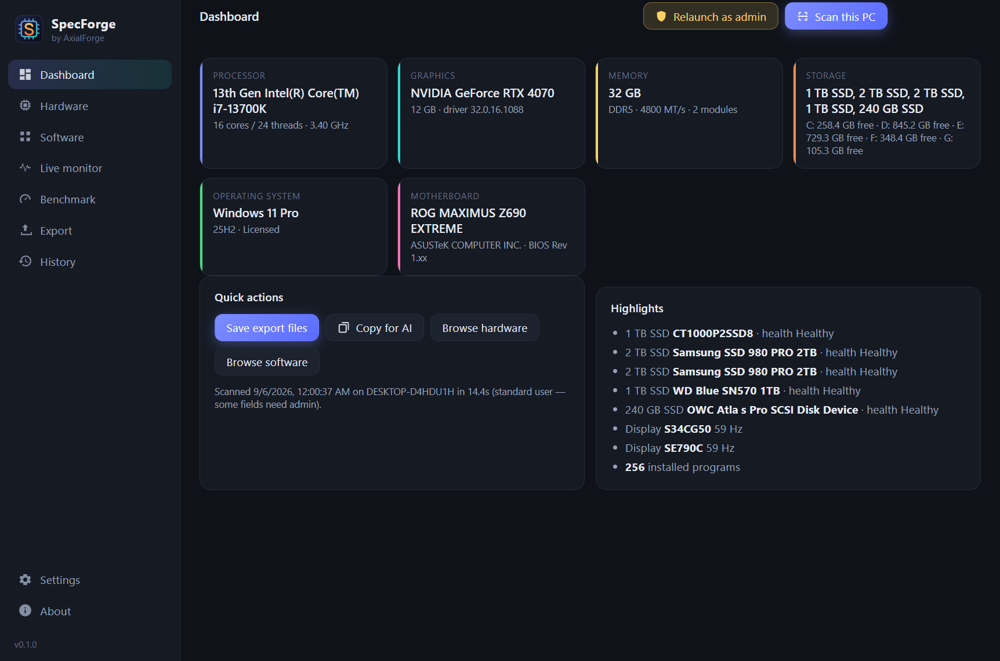
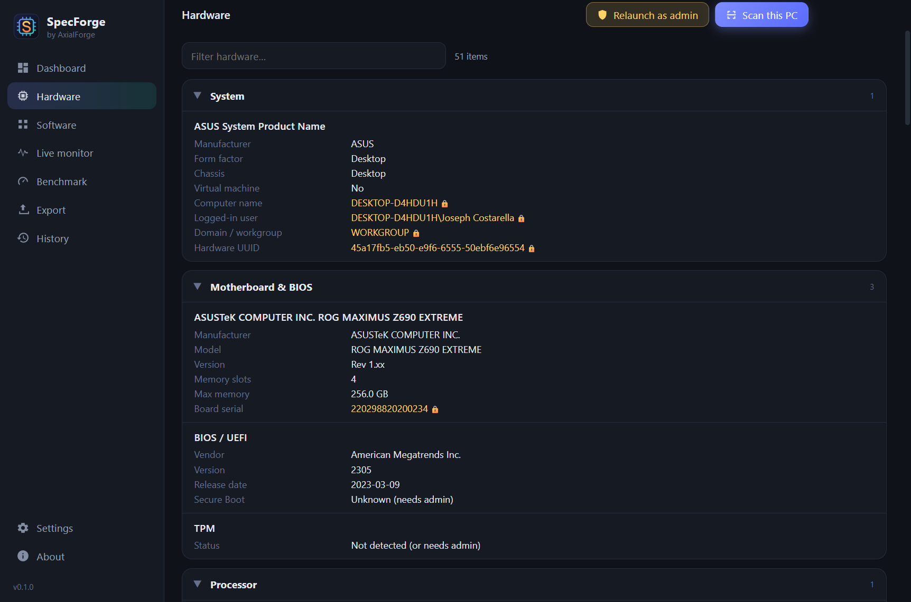
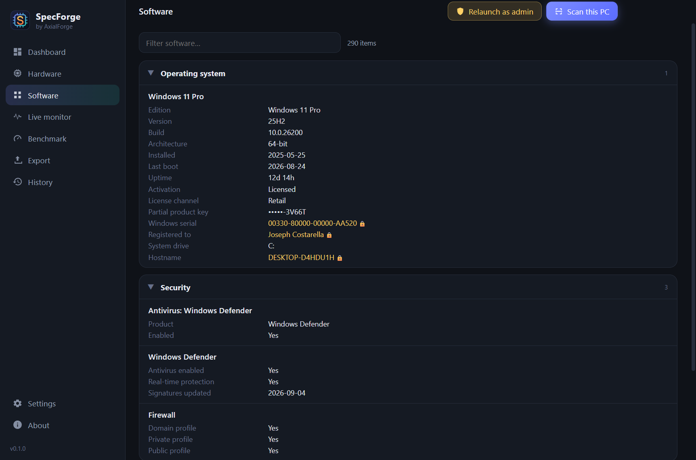
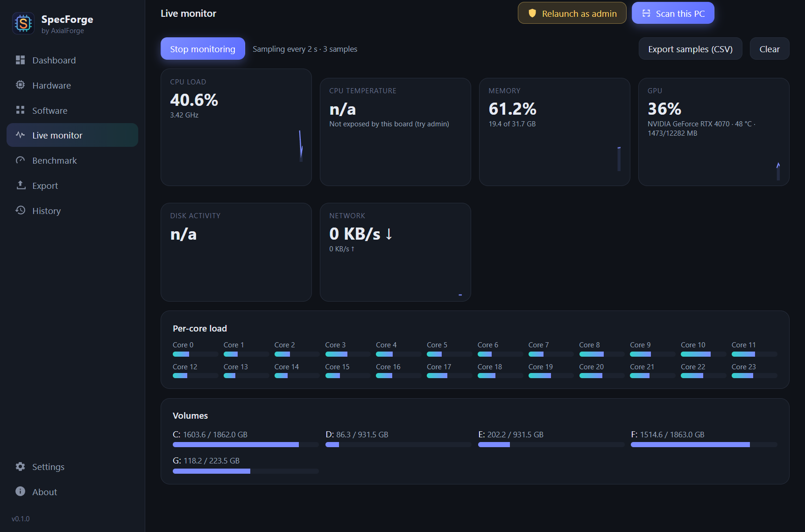
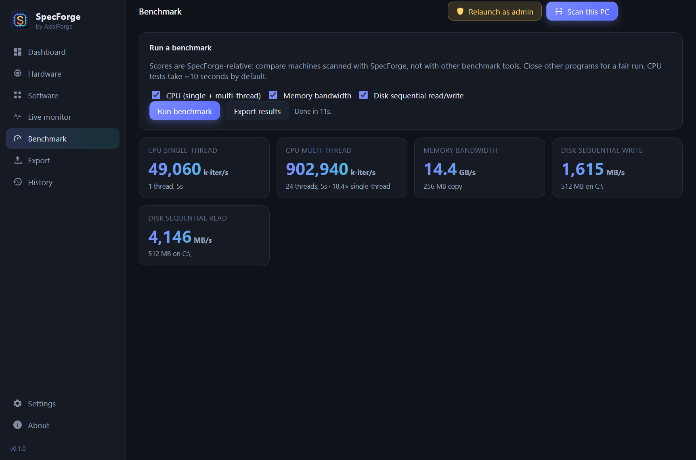
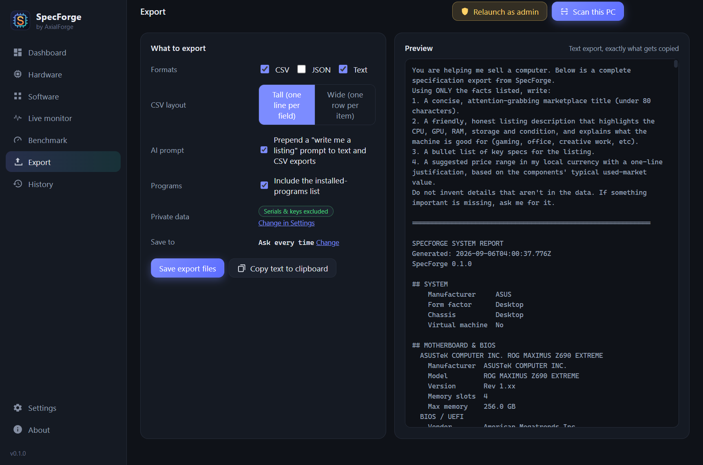
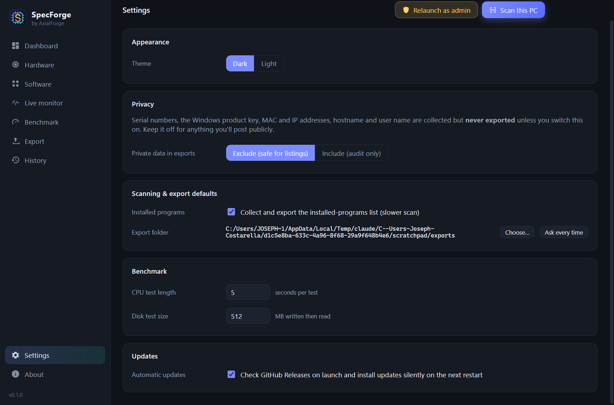

# SpecForge

Forge a spec sheet from any PC.

SpecForge is a Windows desktop app that reads a computer's hardware and
software, shows it on a clean dashboard, and exports it as CSV, JSON or plain
text. The export is built to be pasted into an AI assistant (ChatGPT, Claude,
Gemini) so it can write an eBay or marketplace listing for you, or filed away
as an audit record of what a machine contained on a given date.

It deliberately isn't a monitoring suite or an overclocking tool. The live
monitor and benchmark tabs exist so a listing can say "runs cool, scores X",
not to replace HWiNFO or Cinebench.



## Screenshots

| Hardware | Software |
| --- | --- |
|  |  |

| Live monitor | Benchmark |
| --- | --- |
|  |  |

| Export | Settings |
| --- | --- |
|  |  |

## How to use it

1. Click **Scan this PC**. About 15 seconds later the dashboard fills in.
2. Browse the **Hardware** and **Software** pages, or type in the filter box.
3. On **Export**, tick the formats you want and click **Save export files**, or
   **Copy text to clipboard** and paste it into an AI assistant. With the AI
   prompt option on, the text starts with instructions asking for a title,
   description, spec bullets and a price range.
4. Optionally run the **Live monitor** for a minute or the **Benchmark** and
   export those too.

Every scan is kept under **History** so you can reopen or re-export it later.

## What it collects

- **System** – manufacturer, model, form factor, serial, UUID
- **Motherboard & BIOS** – board, BIOS version/date, Secure Boot, TPM
- **Processor** – model, cores/threads, clocks, cache, socket, virtualization
- **Memory** – total, and every module with size, type, speed, part number
- **Graphics** – every GPU with VRAM, driver (NVIDIA-style version included)
- **Displays** – model, native resolution, refresh rate, size, manufacture date
- **Storage** – every drive with capacity, type, interface, health, wear; every volume with usage
- **Network** – physical adapters, link speed, Wi-Fi, Bluetooth
- **Battery, audio, USB, printers**
- **Operating system** – edition, version, build, install date, activation status, license channel
- **Security** – antivirus, Defender, firewall, BitLocker
- **Installed programs**, recent Windows updates, startup programs

Serial numbers, the Windows product key, MAC/IP addresses and machine/user
names are collected but **excluded from exports by default**. Settings →
Privacy turns them on, behind a warning, for audit use.

## Requirements

- Windows 11 (Windows 10 is untested; planned)
- To build from source: Node 22+ (Node 24 is fine — there are no native modules)

## Install

Download `specforge-<version>-setup.exe` from the
[Releases page](https://github.com/AxialForge/SpecForge/releases) and run it.
It installs per-user (no admin prompt) and adds Start Menu and desktop
shortcuts. Updates are fetched from GitHub Releases in the background and
applied the next time the app is closed.

Some fields (drive health counters, TPM, Secure Boot, CPU temperature on many
boards) need administrator rights. The app runs fine without them and offers a
one-click **Relaunch as admin** in the top bar.

## Run from source

```bash
git clone https://github.com/AxialForge/SpecForge.git
cd SpecForge
npm install
npm run dev
```

## Build

```bash
npm run dist
```

produces `dist/specforge-<version>-setup.exe`. Tagged pushes build the same
thing in CI and attach it to a GitHub Release.

## Development

Architecture, the extension point, and the accumulated gotchas are in
[CLAUDE.md](CLAUDE.md). Read it before changing anything structural.

## License

MIT — see [LICENSE](LICENSE).
